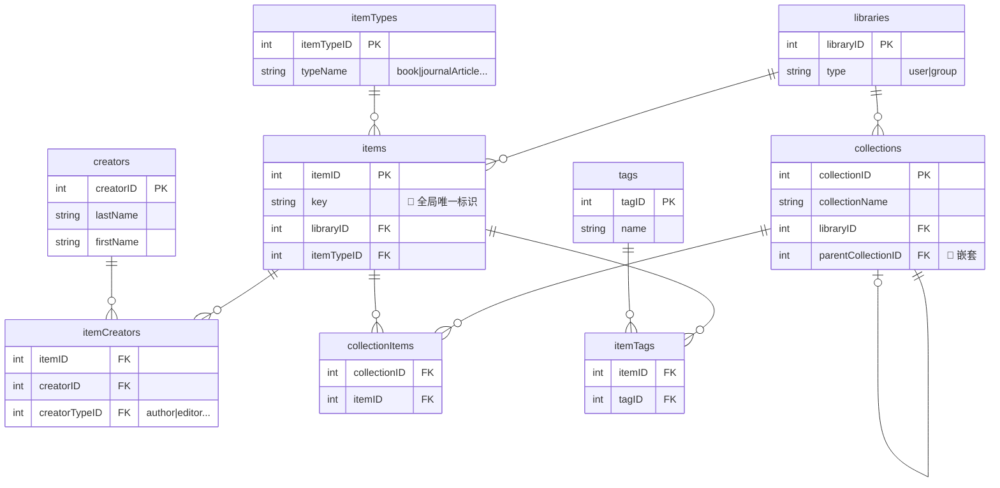

# TL;DR

条目（Item）是 Zotero 管理文献的基本单元

分类（Collection）是分类，不是容器/文件夹

每个条目（Item）在数据库中只有一个唯一实体

分类（Collection）不拥有条目，而只是通过关联关系引用条目，因此同一个条目可以同时属于多个分类。

删除 Collection 不会删除 Item

> [!NOTE]
>Zotero 是以 Item 为中心的关系型数据库模型，Collection 只是对 Item 的多对多引用关系，而不是层级包含关系。

# 链接

[Github仓库](https://github.com/zotero/zotero)

[zotero官网](https://www.zotero.org/)

[官方手册](https://www.zotero.org/support/)

[官方论坛](https://forums.zotero.org/discussions)

[zotero中文社区](https://zotero-chinese.com/)

[安装使用](https://zotero-chinese.github.io/user-guide/install)

[中文 CSL 样式 ](https://zotero-chinese.com/styles/)

[插件开发指南](https://zotero-chinese.com/plugin-dev-guide/)

[CSL文档](https://docs.citationstyles.org/en/stable/primer.html)

[CSL中文文档](https://zotero-chinese.com/csl-dev-guide/)

# zotero

本质是：基于浏览器技术，Item-based，关系型数据库+UI，不是文件夹系统

# 界面

顶部菜单栏

左侧库与分类

中部条目列表：工具栏，搜索框，条目列表

右侧条目详细信息

# 初次使用

## 安装浏览器插件

浏览器扩展商店（支持 Chrome, Edge, Firefox, Safari），安装官方插件。

## 注册开启同步

### 账号注册

在[zotero官网](https://www.zotero.org/)注册账号。

在软件里：编辑 > 首选项 > 同步，登录账号

[账号主页]([Zotero | Your personal research assistant](https://www.zotero.org/settings/profile))

zotero官方免费附件空间 300MB，用于存储附件文件。

而文献条目数据的同步空间免费且无限。

因此[账号存储](https://www.zotero.org/settings/storage)里的`purge storage in my library` 操作，仅仅是删除云空间中同步的附件文件，不会影响条目元数据。

使用WebDAV 或本地只读，或者要将空间腾出给群组，则点击`purge storage in my library`

Zotero 在后台是把您的库分成两部分来独立管理的：

1. 数据 (Data)： 也就是文献的标题、作者、年份、摘要、笔记和文件夹分类。这部分是无限制免费同步的。
2. 文件 (Files/Storage)： 也就是 PDF 全文、图片附件等。这部分受 300MB 空间限制。

### 同步设置

勾选数据同步的`自动同步`和`同步全文内容`（不限制容量、完全免费的纯文本数据）

- 自动同步：同步文献库条目和操作
- 同步全文内容： 从PDF 里提取出来的纯文字搜索索引

取消文件同步的两个选项：

- “我的文库”附件同步方式：个人专属的文献库， PDF 全文、网页快照等文件
- 使用 Zotero 云存储同步群组文献库中的附件：**共享文献库**（群组），群组里的附件，只能用 Zotero 官方的云空间来同步。

## 安装文字处理器插件（word）

Zotero 通常会自动为您安装 Word 或 LibreOffice 插件。

如果在 Word 顶部菜单栏没看到 Zotero 选项卡，可以进入 **编辑 > 设置 > 引用 > 文档编辑软件** 中手动重新安装。

## 更改数据存储位置

为了节省 C 盘空间，将数据转移到 D 盘或 E 盘

- 打开 Zotero，点击顶部菜单栏的 **编辑 > 设置**。
- 在弹出的窗口中，选择 **高级** 选项卡，下划到**文件和文件夹**。
- 在“**数据存储位置**”。点击“选择”
- 此时会弹出一个文件夹选择窗口，请选择新建的 文件夹
- Zotero 此时通常会弹出一个提示框，询问您**是否要将现有的数据移动到新位置**，请务必选择 **“是”**（Yes）。
- Zotero 会自动重启，并将原先 C 盘里的所有数据平移到 D 盘。


## 安装插件

### Jasminum (茉莉花) 插件（中文环境）

专门用于识别和抓取知网等中文数据库的文献信息，并能将作者的“姓”和“名”正确拆分。

## 添加国标引用格式

进入 编辑 > 首选项 > 引用 > 样式。

点击“获取更多样式...”，搜索 `China National Standard GB/T 7714` 并安装（分为 Author-Date 格式和 Numeric 格式），这是国内写论文最标准的参考文献格式。

点击“获取中文社区样式”，搜索`GB/T 7714—2015（顺序编码，双语，姓名不大写，无URL DOI）`，或者所在大学名称，一般用这个。

## 存储空间优化（webdev）

暂无。

# 条目 item

## Zotero 最核心的数据单位

条目是 Zotero 管理文献的基本单元

- 每个条目代表一条独立的参考文献记录，如一本书、一篇期刊文章、一个网页、一份报告等
- 每个条目存储元数据（metadata），包括标题、作者、出版日期、出版社、摘要、标签等信息。
- 条目还可以关联附件（如 PDF 全文、网页快照、笔记等），形成"条目 + 附件"的完整文献管理结构

## 条目特点

多种条目类型（Item Types），如 Book、Journal Article、Webpage、Dataset 等

以元数据为核心，所有条目数据主要存储在 `zotero.sqlite` 数据库文件中，包含元数据、笔记、标签等

条目可以包含子条目

每个条目都是独立的引用单元，可直接用于生成参考文献和引文

## 数据模型

简化版：

```
Zotero 数据库 (zotero.sqlite)
└── 条目 (Item) ← 核心单位
    ├── 元数据字段（标题、作者、日期等）
    ├── 附件（Attachment）：PDF、图片等
    ├── 笔记（Note）：用户注释
    └── 标签（Tags）：分类标记
```

详细版：

```
Zotero
└── Library（文库）
    ├── My Library（个人库）
    │   ├── Collection（分类）
    │   │   ├── Subcollection（子分类）
    │   │   │   ├── Item（条目）
    │   │   │   │   ├── Metadata（元数据）
    │   │   │   │   │   ├── Title
    │   │   │   │   │   ├── Author
    │   │   │   │   │   ├── Year
    │   │   │   │   │   ├── Publication
    │   │   │   │   │   └── DOI / URL / ISBN
    │   │   │   │   │
    │   │   │   │   ├── Attachment（附件）
    │   │   │   │   │   ├── PDF
    │   │   │   │   │   ├── Snapshot
    │   │   │   │   │   ├── Image
    │   │   │   │   │   └── File
    │   │   │   │   │
    │   │   │   │   ├── Note（笔记）
    │   │   │   │   │   ├── Child Note（子笔记）
    │   │   │   │   │   └── Standalone Note（独立笔记）
    │   │   │   │   │
    │   │   │   │   └── Tag（标签）
    │   │   │   │       ├── Tag A
    │   │   │   │       ├── Tag B
    │   │   │   │       └── Tag C
    │   │   │   │
    │   │   │   └── Item（条目）
    │   │   │
    │   │   └── Collection
    │   │
    │   ├── Collection
    │   │
    │   ├── Standalone Item（未分类条目）
    │   │
    │   └── Standalone Note（未归属笔记）
    │
    └── Group Library（群组库）
        ├── Collection
        ├── Item
        ├── Attachment
        └── Note
```


## 类型&图标

会议论文 (Conference Paper)：图标是一个橙色讲台

期刊论文 (Journal Article)：图标是灰白色张普通的纸，上面有几行横线。

预印本：一张纸，上面斜放着一支铅笔（或者笔）。

网页：一个外白内蓝的网页图标

# 分类 collection

Collection 是分类，不是容器

一个 Item 可以在多个 Collection，删除 Collection 不会删除 Item，Collection 只是视图


# CSL 

Citation Style Language（引用样式语言）

## 网站

[中文 CSL 样式 ](https://zotero-chinese.com/styles/)

[CSL文档](https://docs.citationstyles.org/en/stable/primer.html)

[CSL中文文档](https://zotero-chinese.com/csl-dev-guide/)

## 介绍

开源的、基于 XML 的格式标准，专门用来描述文献引用（in-text citations）和参考文献列表（bibliographies）的格式规则。

学术写作中，不同期刊/会议/学位论文对引用格式要求千差万别（APA、MLA、Chicago、Vancouver、GB/T 7714、中国国家标准等）。

CSL 让软件自动生成正确的格式：只管输入文献元数据（作者、标题、年份、DOI 等），软件根据 CSL 样式文件自动输出引用和参考文献。

## 特点

**开源 & 社区驱动**：由 CitationStyles.org 项目维护，目前有超过 **10,000 个免费样式**（包括几乎所有主流期刊的样式）。

**独立于软件**：同一个 .csl 文件可以在 Zotero、Mendeley、RefWorks、Word 的插件等多个工具中使用。

**版本**：当前主流是 CSL 1.0.1 / 1.0.2，支持复杂规则如条件判断（e.g., 作者超过3人显示 et al.）、本地化（中文/英文/法文等不同语言的“et al.”、“编”等）、数值范围压缩等。

**文件后缀**：.csl（纯文本 XML 文件）。

## 注意

插件和样式，安装成功后，原文件（.xpi 插件包和 .csl 样式文件）都可以直接删除

**对于插件 (.xpi)：** Zotero 会提取插件的核心文件，并将它们复制到自己专门存放扩展程序的隐藏系统文件夹中。

**对于样式 (.csl)：** Zotero 会把这个文件直接复制到您之前设置好的 `数据存储文件夹` 目录下的 `styles` 文件夹里。

# 插件

工具--> 插件

Awesome GPT

Batter Notes for zotero

Easier Citation

Ethereal Reference

Ethereal Style

Jasminum茉莉花

ZotCard

# 数据存储&sqlite

## 文件夹结构

**`zotero.sqlite`**（这是一个数据库文件）：所有的文献条目（标题、作者、摘要）、建立的分类文件夹结构、标签以及笔记。

**`storage`**（文件夹）：**所有的 PDF 和附件。**

- 点进 `storage`，有很多由 **8位随机字母和数字** 组成的文件夹（例如 `X7B9F2A1`）。
- 每个 8 位乱码文件夹对应着库里的一篇文献，点进去就是那篇文献的 PDF 原文。

## sqlite表结构

```mermaid
erDiagram
    %% ==================== 核心条目模块 ====================
    items {
        int itemID PK
        int itemTypeID FK
        timestamp dateAdded
        timestamp dateModified
        int libraryID FK
        text key
        int version
        int synced
    }
    
    itemTypes {
        int itemTypeID PK
        text typeName
        int templateItemTypeID
        int display
    }
    
    itemTypeFields {
        int itemTypeID FK
        int fieldID FK
        int hide
        int orderIndex
    }
    
    fields {
        int fieldID PK
        text fieldName
        int fieldFormatID FK
    }
    
    itemData {
        int itemID FK
        int fieldID FK
        int valueID FK
    }
    
    itemDataValues {
        int valueID PK
        text value
    }
    
    %% ==================== 创作者模块 ====================
    creators {
        int creatorID PK
        text firstName
        text lastName
        int fieldMode
    }
    
    creatorTypes {
        int creatorTypeID PK
        text creatorType
    }
    
    itemCreators {
        int itemID FK
        int creatorID FK
        int creatorTypeID FK
        int orderIndex
    }
    
    itemTypeCreatorTypes {
        int itemTypeID FK
        int creatorTypeID FK
        int primaryField
    }
    
    %% ==================== 集合/文件夹模块 ====================
    collections {
        int collectionID PK
        text collectionName
        int parentCollectionID FK
        timestamp clientDateModified
        int libraryID FK
        text key
        int version
        int synced
    }
    
    collectionItems {
        int collectionID FK
        int itemID FK
        int orderIndex
    }
    
    %% ==================== 库模块 ====================
    libraries {
        int libraryID PK
        text type
        int editable
        int filesEditable
        int version
        int storageVersion
        int lastSync
        int archived
    }
    
    %% ==================== 标签模块 ====================
    tags {
        int tagID PK
        text name
    }
    
    itemTags {
        int itemID FK
        int tagID FK
        int type
    }
    
    %% ==================== 附件模块 ====================
    itemAttachments {
        int itemID PK
        int parentItemID FK
        int linkMode
        text contentType
        int charsetID FK
        text path
        int syncState
        text storageHash
    }
    
    charsets {
        int charsetID PK
        text charset
    }
    
    %% ==================== 笔记模块 ====================
    itemNotes {
        int itemID PK
        int parentItemID FK
        text note
        text title
    }
    
    %% ==================== 注释模块 ====================
    itemAnnotations {
        int itemID PK
        int parentItemID FK
        int type
        text authorName
        text text
        text comment
        text color
        text pageLabel
        text position
    }
    
    %% ==================== 全文搜索模块 ====================
    fulltextItems {
        int itemID PK
        int indexedPages
        int totalPages
        int indexedChars
        int totalChars
        int version
        int synced
    }
    
    fulltextWords {
        int wordID PK
        text word
    }
    
    fulltextItemWords {
        int wordID FK
        int itemID FK
    }
    
    %% ==================== 关系模块 ====================
    relationPredicates {
        int predicateID PK
        text predicate
    }
    
    itemRelations {
        int itemID FK
        int predicateID FK
        text object
    }
    
    collectionRelations {
        int collectionID FK
        int predicateID FK
        text object
    }
    
    %% ==================== 删除日志模块 ====================
    deletedItems {
        int itemID PK
        timestamp dateDeleted
    }
    
    deletedCollections {
        int collectionID PK
        timestamp dateDeleted
    }
    
    deletedSearches {
        int savedSearchID PK
        timestamp dateDeleted
    }
    
    %% ==================== 保存搜索模块 ====================
    savedSearches {
        int savedSearchID PK
        text savedSearchName
        timestamp clientDateModified
        int libraryID FK
        text key
        int version
        int synced
    }
    
    savedSearchConditions {
        int savedSearchID FK
        int searchConditionID
        text condition
        text operator
        text value
    }
    
    %% ==================== 同步模块 ====================
    syncObjectTypes {
        int syncObjectTypeID PK
        text name
    }
    
    syncQueue {
        int libraryID FK
        text key
        int syncObjectTypeID FK
        timestamp lastCheck
        int tries
    }
    
    syncCache {
        int libraryID FK
        text key
        int syncObjectTypeID FK
        int version
        text data
    }
    
    %% ==================== 自定义字段模块 ====================
    customItemTypes {
        int customItemTypeID PK
        text typeName
        text label
        int display
        text icon
    }
    
    customFields {
        int customFieldID PK
        text fieldName
        text label
    }
    
    customItemTypeFields {
        int customItemTypeID FK
        int fieldID FK
        int customFieldID FK
        int hide
        int orderIndex
    }
    
    %% ==================== 用户模块 ====================
    users {
        int userID PK
        text name
    }
    
    groupItems {
        int itemID FK
        int createdByUserID FK
        int lastModifiedByUserID FK
    }
    
    %% ==================== 版本模块 ====================
    version {
        text schema PK
        int version
    }
    
    %% ==================== 关系定义 ====================
    libraries ||--o{ items : contains
    libraries ||--o{ collections : contains
    libraries ||--o{ savedSearches : contains
    libraries ||--o{ syncQueue : tracks
    libraries ||--o{ syncCache : caches
    
    itemTypes ||--o{ items : categorizes
    itemTypes ||--o{ itemTypeFields : defines
    itemTypes ||--o{ itemTypeCreatorTypes : specifies
    
    fields ||--o{ itemData : stores
    fields ||--o{ itemTypeFields : belongs
    
    items ||--o{ itemData : has
    items ||--o{ itemCreators : authored
    items ||--o{ itemTags : tagged
    items ||--o{ itemAttachments : attaches
    items ||--o{ itemNotes : notes
    items ||--o{ itemAnnotations : annotates
    items ||--o{ itemRelations : relates
    items ||--o{ fulltextItems : indexed
    items ||--o{ collectionItems : collected
    items ||--o{ deletedItems : deleted
    items ||--o{ groupItems : grouped
    
    creators ||--o{ itemCreators : creates
    creatorTypes ||--o{ itemCreators : types
    creatorTypes ||--o{ itemTypeCreatorTypes : defines
    
    collections ||--o{ collectionItems : contains
    collections ||--o{ deletedCollections : deleted
    collections ||--o{ collectionRelations : relates
    collections ||--o| collections : "parent-child"
    
    tags ||--o{ itemTags : applies
    
    itemAttachments ||--o{ itemAnnotations : "parent of"
    itemAttachments ||--o| charsets : uses
    
    itemNotes ||--o| items : "parent of"
    
    fulltextItems ||--o{ fulltextItemWords : contains
    fulltextWords ||--o{ fulltextItemWords : references
    
    relationPredicates ||--o{ itemRelations : defines
    relationPredicates ||--o{ collectionRelations : defines
    
    savedSearches ||--o{ savedSearchConditions : has
    savedSearches ||--o{ deletedSearches : deleted
    
    syncObjectTypes ||--o{ syncQueue : types
    syncObjectTypes ||--o{ syncCache : types
    
    customItemTypes ||--o{ customItemTypeFields : defines
    customFields ||--o{ customItemTypeFields : uses
    
    users ||--o{ groupItems : owns
```



精简版




# run JS

**工具 > 开发者 > Run Javascript**

## 批量修改条目语言

```js
var items = ZoteroPane.getSelectedItems();
for (let item of items) {
    if (item.isRegularItem()) {
        item.setField('language', 'en');
        await item.saveTx();
    }
}
return "搞定！已成功将 " + items.length + " 篇文献的语言修改为 en。";
```


# 操作

## 创建表头

默认只有：标题，创建者，添加日期三个表头

右键表头即可看到列表，选择需要的即可。

## 回收站按时间排序

### 现状

回收站只有标题，创建者两个表头。并且，右键也没有“删除日期”这个表头。

即在zotero的回收站里，没有任何办法根据删除时间排序！并且没有任何一款插件能补上这个底层级的功能缺失。

但是，Zotero 实际上精确记录了删除时间，底层 SQLite 数据库里专门建了一个名为 `deletedItems` 的表，里面清清楚楚地记录着每一个被删条目的 `dateDeleted`（删除时间戳）。

即可以通过zotero.sqlite， 查看 Zotero 回收站删除时间排序。

### 解决方法

软件：Navicat Premium 16，zotero 8

#### 定位并备份 `zotero.sqlite`

Zotero 的所有核心数据（除了具体的 PDF 附件）都存在这个文件里。

- **如何找到：**
  1. 打开 Zotero，点击顶部菜单栏的 **编辑** -> **设置**。
  2. 选择 **高级** 选项卡，再点击 **文件和文件夹** 子选项卡。
  3. 点击 **“打开数据文件夹”** 按钮。系统文件管理器会弹出一个窗口，里面就能看到 `zotero.sqlite` 文件。
- **安全操作：** 看到文件后，关闭 Zotero 软件。在 Zotero 运行期间，数据库是锁定的，强行用其他软件读取极容易导致数据库损坏。
- 将zotero.sqlite复制，后续操作均在副本内进行。

#### 在 Navicat 中打开数据库

1. 打开 Navicat。
2. 点击左上角的 **new connection** -> **SQLite**。
3. 在弹出的窗口中，connection name填入随意名称。
4. database file，浏览并选择 `zotero.sqlite` 副本。
5. 点击“确定”，就能看到 Zotero 底层的各种表（Tables）。

#### 执行查询命令

在 Navicat 中点击 **“new query”**，运行以下代码：

```
SELECT
    datetime(deletedItems.dateDeleted, 'localtime') AS "删除时间",
    itemDataValues.value AS "文献标题"
FROM deletedItems
JOIN itemData ON deletedItems.itemID = itemData.itemID
JOIN fields ON itemData.fieldID = fields.fieldID
JOIN itemDataValues ON itemData.valueID = itemDataValues.valueID
WHERE fields.fieldName = 'title'
ORDER BY deletedItems.dateDeleted DESC;
```

即可看到按照删除时间排序的回收站内容。

## 删除条目 vs. 从分类中移除条目

删除条目是删除条目物理实体，会进入回收站保留30天

从分类中移除条目只是取消引用，条目仍然保留物理实体。

所以不同分类里同一个文献会同步删除，引用的是同一个物理实体的缘故.

# 问题

## 顶层Library在哪？为什么软件页面看不到？

Zotero默认只有一个 Library，顶层 Library 是数据库本身，UI直接把 My Library 当作根节点

我的文库即个人库即My Library，所以打开软件看到“我的文库”

```
Library（数据库级）
└── My Library（个人库）
    └── Collections / Items / Notes / Tags
```

当加入群组时，才会出现平行于“我的文库”的其他群组库。	

## zotero 6、7、8有什么不同？

| 特性          | Zotero 6   | Zotero 7                                                     | Zotero 8 (目前测试版)                                        |
| :------------ | :--------- | :----------------------------------------------------------- | :----------------------------------------------------------- |
| **核心架构**  | 成熟稳定版 | **重大重构**，界面现代化（例如解决了你提到的回收站排序问题），底层代码更新，为未来功能铺路 。 | 基于Zotero 7的进一步优化。                                   |
| **PDF阅读器** | 基础功能   | **完全重写的内置PDF阅读器**，功能更强，与笔记系统的集成度极高，可以划重点、添加注释并直接提取到笔记中 。 | 在7的基础上继续打磨和增强。                                  |
| **笔记功能**  | 独立笔记   | **笔记功能大幅增强**，可以添加引用、插入图片，并与PDF阅读器深度联动，更像一个真正的知识管理工具 。 | 可能会进一步完善笔记功能和与其他插件的兼容性。               |
| **插件生态**  | 插件丰富   | 因为底层架构变了，**很多为Zotero 6开发的插件需要更新才能在7上使用**。不过主流插件基本都已适配。 | 随着更多用户转向Zotero 7/8，插件开发者会重点维护新版本，生态会更加稳定。 |


